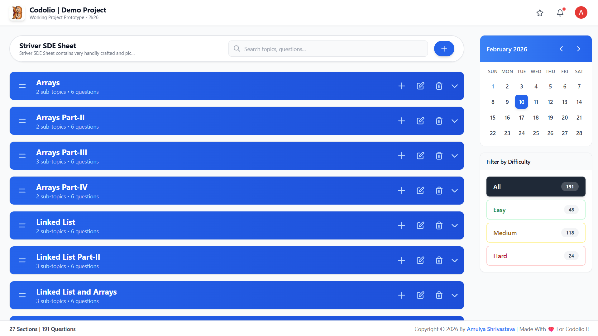
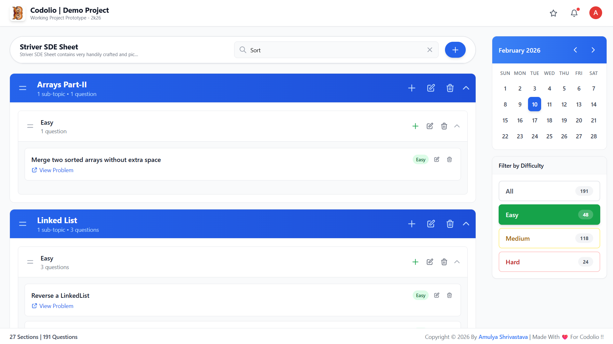

# 🚀 Codolio Demo Project

## 📌 Project Overview

**Codolio | Demo Project** is a frontend demo application built to showcase UI features and basic functionality using modern web technologies. This repository serves as a presentation layer and demo testing ground for Codolio.


## 👨‍💻 Author

- **Created By:** Amulya Shrivastava  
- **Created For:** Codolio  
- **Linkedin:** https://www.linkedin.com/in/amulya-shrivastava-11a0a9288/
- **Live Link:** https://codoliodemo.netlify.app/

## Introduction

The **Interactive Question Management Sheet** is a single-page web application designed to help users organize and manage a hierarchical collection of questions grouped by topics and sub-topics.

The application enables users to dynamically create, edit, delete, and reorder topics, sub-topics, and individual questions through an intuitive drag-and-drop interface. The primary goal is to provide a clean, responsive, and user-friendly experience for maintaining structured learning or assessment content.


## ✅ Functional Requirements

- **Topic Management**
  - Create, edit, and delete topics.

- **Sub-topic Management**
  - Create, edit, and delete sub-topics under existing topics.

- **Question Management**
  - Create, edit, and delete questions within specific topics and sub-topics.

- **Reordering**
  - Reorder topics, sub-topics, and questions using drag-and-drop functionality.
- **API Integrated**
  - Implemented basic CRUD APIs (mock APIs or in-memory storage is acceptable).
  - Reference API for fetching sheet data:

  ```bash 
  curl --location 'https://node.codolio.com/api/question-tracker/v1/sheet/public/get-sheet-by-slug/striver-sde-sheet'
    ```

## 📌 Assumptions

- The application is implemented as a single-page web app.
- The user interface prioritizes simplicity and usability.
- Developers are free to design the UI as long as all functional requirements are met (reference: Codolio platform).


## 📸 Screenshots





## ⚙️ Tech Stack

- ⚛️ **React.js** — Frontend library  
- 🧠 **JavaScript** — Logic & functionality  
- 🎨 **Tailwind CSS** — Utility-first styling  
- 🌐 **Netlify** — Single Page Application hosting  

### 📁 File Tree: Codolio-Project

- **Generated:** 2/10/2026, 12:15:37 PM
- **Root Path:** `Your Directory\Codolio-Project`


## 🛠️ Setup Instructions

Follow these steps to run the project locally:

### 1️⃣ Clone the Repository
```bash
git clone https://github.com/Always-Amulya7/Codolio-Project
```

### 2️⃣ Navigate to Project Folder
```bash
cd Codolio-Project
```

### 3️⃣ Install Dependencies
```bash
npm install
```

### 4️⃣ Start Development Server
```bash
npm run dev
```

### 5️⃣ View the App Visit:
```bash
http://localhost:<PORT NUMBER USED>
```

## ✅ Features

1. Responsive UI for all screen sizes.
2. Tailwind-based styling.
3. Component-driven React architecture.
4. Fast development with Vite.
5. Deployed live on Netlify.
   
## 📬 Contact

- For any queries or collaboration:
- 📧 Email: amulyashrivastava7@gmail.com

## ⭐ Support

- If you found this project helpful, please consider giving it a ⭐ on GitHub.
- 🙌 Thanks for visiting!
